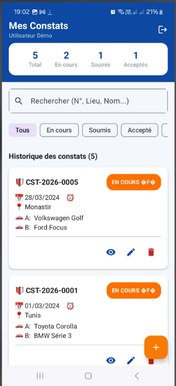
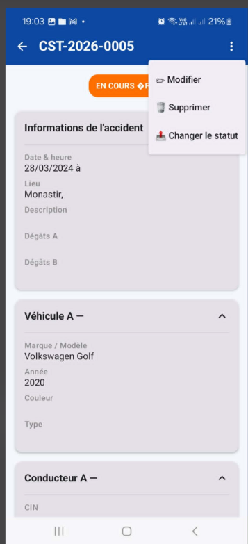
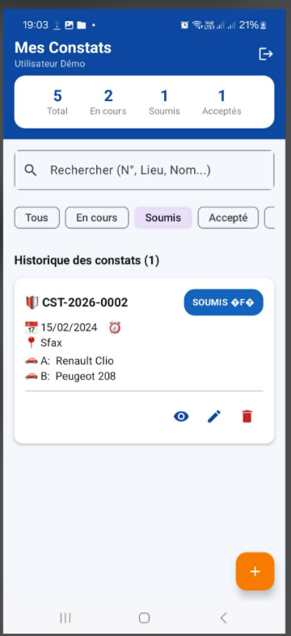

# ConstatAuto 🛡️🚗
> **Votre constat numérique, simple et rapide** — Application Android de gestion de constats automobiles numériques.

---

## 🖼️ Aperçu visuel

<p align="center">
  
  
  
</p>

<p align="center">
  
  
  
</p>

<p align="center">
  
</p>

---

## 1. 📋 Présentation du projet

**ConstatAuto** est une application mobile moderne conçue pour simplifier et numériser le processus de remplissage d'un constat amiable d'accident automobile. Dans un moment de stress comme un accident de la route, l'application guide l'utilisateur pas à pas pour capturer toutes les informations nécessaires de manière structurée et lisible.

### Pourquoi une application de constat numérique ?
Le constat papier traditionnel présente plusieurs inconvénients : il est souvent difficile à trouver dans la boîte à gants, l'écriture peut être illisible sous l'effet du stress, et les erreurs de remplissage peuvent entraîner des complications avec les assureurs. **ConstatAuto** résout ces problèmes en offrant une interface intuitive, des validations en temps réel et un stockage sécurisé sur le téléphone.

### Public cible
L'application s'adresse à tous les conducteurs souhaitant disposer d'un outil fiable en cas de sinistre. Elle est également pensée pour faciliter le travail des compagnies d'assurance en fournissant des données claires, horodatées et complètes.

### Fonctionnalités principales
- **Authentification sécurisée** : Accès protégé par compte utilisateur (simulation locale).
- **Tableau de bord intelligent** : Vue d'ensemble des statistiques et historique des constats.
- **Formulaire Multi-étapes** : Processus guidé en 4 étapes pour ne rien oublier.
- **Gestion des statuts** : Suivi de l'évolution du constat (Brouillon, Soumis, Accepté, Refusé).
- **Persistance des données** : Sauvegarde automatique locale via SharedPreferences et JSON.
- **Recherche et Filtrage** : Localisation rapide d'un constat par numéro ou par statut.

### Limitations connues
- **Absence de Backend** : Toutes les données sont stockées localement sur le périphérique.
- **Persistance éphémère** : La désinstallation de l'application entraîne la suppression définitive des données.
- **Pas de signature numérique** : Le système actuel ne gère pas encore la signature tactile certifiée.

---

## 2. 🖼️ Aperçu des écrans

### `LoginScreen`
- **Route** : `login`
- **Rôle** : Point d'entrée de l'application. Permet à l'utilisateur de s'identifier.
- **Éléments UI** : En-tête bleu marine avec icônes de protection, champs de saisie pour l'email et le mot de passe, bouton de connexion avec animation de vibration en cas d'erreur, et lien vers la création de compte.

### `RegisterScreen`
- **Route** : `register`
- **Rôle** : Permet aux nouveaux utilisateurs de créer un compte local.
- **Éléments UI** : Formulaire complet (Nom, Prénom, Téléphone, Email, Mot de passe), case à cocher pour les conditions d'utilisation (CGU), et intégration avec le système de validation en temps réel.

### `HomeScreen` (Dashboard)
- **Route** : `home`
- **Rôle** : Hub central de l'application. Affiche les statistiques et la liste des rapports.
- **Éléments UI** : TopAppBar avec bouton de déconnexion, carte de statistiques (Total, En cours, Soumis, Acceptés), barre de recherche, jetons de filtrage par statut, et une `LazyColumn` affichant les `ConstatCard`.

### `ConstatFormScreen` (4 étapes)
- **Route** : `constat/form?id={id}`
- **Rôle** : Création ou modification d'un constat.
- **Étapes** :
    1. **Accident** : Date, heure, lieu, gouvernorat et description des dommages.
    2. **Véhicule A** : Informations sur le véhicule de l'utilisateur et son profil conducteur.
    3. **Véhicule B** : Informations sur la partie adverse.
    4. **Résumé** : Récapitulatif global avant soumission finale.
- **Éléments UI** : Indicateur de progression (`StepIndicator`), sélecteurs de date et d'heure, menus déroulants (`ExposedDropdownMenuBox`).

### `ConstatDetailScreen`
- **Route** : `constat/detail/{id}`
- **Rôle** : Visualisation complète et en lecture seule des détails d'un constat existant.
- **Éléments UI** : Badge de statut proéminent, sections extensibles (`ExpandableSection`) pour chaque catégorie d'information, et menu d'options pour changer le statut ou supprimer le rapport.

---

## 3. 🏗️ Architecture logique (MVVM + Repository)

L'application suit scrupuleusement les principes d'architecture recommandés par Google pour Android, favorisant une séparation claire des préoccupations.

### 3.1 Pourquoi MVVM ?
- **Séparation des responsabilités** : L'interface utilisateur ne connaît pas la logique métier ou le stockage.
- **Testabilité** : Les ViewModels et Repositories peuvent être testés indépendamment de l'UI.
- **Réactivité** : L'utilisation de `StateFlow` permet une mise à jour instantanée de l'interface dès que les données changent.

### 3.2 Diagramme ASCII des couches

```text
┌─────────────────────────────────────────────────────┐
│                   UI LAYER (View)                   │
│  LoginScreen  HomeScreen  ConstatFormScreen  ...    │
│         Jetpack Compose @Composable functions       │
└──────────────────────┬──────────────────────────────┘
                       │ observe StateFlow
                       │ appelle les fonctions ViewModel
┌──────────────────────▼──────────────────────────────┐
│               VIEWMODEL LAYER                       │
│        AuthViewModel   ConstatViewModel             │
│  - Détient l'état UI (StateFlow / MutableStateFlow) │
│  - Logique métier (validation, filtrage, stats)     │
│  - Survit aux changements de configuration         │
└──────────────────────┬──────────────────────────────┘
                       │ appelle les méthodes repository
┌──────────────────────▼──────────────────────────────┐
│              REPOSITORY LAYER                       │
│              ConstatRepository                      │
│  - Source unique de vérité (Single source of truth) │
│  - Abstraction de l'accès aux SharedPreferences     │
│  - Sérialisation / Désérialisation via Gson         │
└──────────────────────┬──────────────────────────────┘
                       │ lit / écrit
┌──────────────────────▼──────────────────────────────┐
│              PERSISTENCE LAYER                      │
│         SharedPreferences + Gson (JSON)             │
│  - constats_list  (Array JSON de Constat)           │
│  - users_list     (Map JSON d'utilisateurs)         │
│  - constat_counter (Int, auto-incrément)            │
└─────────────────────────────────────────────────────┘
```

### 3.3 Flux de données (Data Flow)
L'application utilise un flux de données unidirectionnel (UDF) :
1. **Action Utilisateur** : L'utilisateur clique sur un bouton dans un Composable.
2. **ViewModel** : Le Composable appelle une fonction du ViewModel.
3. **Repository** : Le ViewModel demande au Repository d'effectuer une opération CRUD.
4. **SharedPreferences** : Le Repository persiste les données sur le disque.
5. **Mise à jour d'État** : Le ViewModel met à jour son `MutableStateFlow`.
6. **Recomposition** : L'UI observe le changement et se redessine automatiquement.

### 3.4 Diagramme ASCII du flux de navigation

```text
  [LoginScreen] ──────────────────────────────────┐
       │                                           │
       │ "Créer un compte"                         │ succès connexion
       ▼                                           │
  [RegisterScreen] ──────── succès inscription ─────┤
                                                   ▼
                                          [HomeScreen / Dashboard]
                                           │          │
                              FAB "+"      │          │  clic "Voir"
                                           │          │
                    ┌──────────────────────┘          └────────────────┐
                    ▼                                                   ▼
          [ConstatFormScreen]                              [ConstatDetailScreen]
          Step 1: Accident                                  - vue lecture seule
          Step 2: Véhicule A                                - changer statut
          Step 3: Véhicule B                                - supprimer / éditer
          Step 4: Résumé + Save
                    │
                    └──── sauvegarde ──→ [HomeScreen] (avec Snackbar)
```

---

## 4. 📁 Structure complète du projet

```text
com.example.constatauto/
├── ConstatAutoApp.kt                  ← Classe Application (initialisation)
├── MainActivity.kt                    ← Point d'entrée, configuration du Thème
│
├── navigation/
│   └── AppNavigation.kt               ← NavHost et définition des routes
│
├── model/
│   ├── Constat.kt                     ← Modèle de données principal
│   ├── Conducteur.kt                  ← Modèle imbriqué pour le conducteur
│   ├── Vehicule.kt                    ← Modèle imbriqué pour le véhicule
│   └── StatutConstat.kt               ← Enumération des statuts possibles
│
├── repository/
│   └── ConstatRepository.kt           ← Logique de persistance CRUD
│
├── viewmodel/
│   ├── AuthViewModel.kt               ← Gestion de la session et inscription
│   └── ConstatViewModel.kt            ← Gestion des constats et filtrage
│
├── ui/
│   ├── auth/
│   │   ├── LoginScreen.kt             ← Interface de connexion
│   │   └── RegisterScreen.kt          ← Interface d'inscription
│   ├── home/
│   │   └── HomeScreen.kt              ← Tableau de bord et liste
│   ├── constat/
│   │   ├── ConstatFormScreen.kt       ← Formulaire multi-étapes
│   │   ├── ConstatDetailScreen.kt     ← Vue détaillée
│   │   └── components/
│   │       ├── ConstatCard.kt         ← Carte d'item de liste
│   │       ├── StatusBadge.kt         ← Badge coloré de statut
│   │       ├── StepIndicator.kt       ← Barre de progression du formulaire
│   │       └── SectionHeader.kt       ← Titres de sections stylisés
│   └── theme/
│       ├── Color.kt                   ← Palette de couleurs
│       ├── Theme.kt                   ← Configuration Material3
│       └── Type.kt                    ← Typographie personnalisée
│
└── utils/
    ├── DateUtils.kt                   ← Utilitaires de formatage temporel
    └── ValidationUtils.kt             ← Règles de validation des formulaires
```

---

## 5. 📄 Description détaillée de chaque fichier

### `ConstatAutoApp.kt`
**Chemin :** `com/example/constatauto/ConstatAutoApp.kt`  
**Couche :** Base / Application  
**Rôle :** Point d'entrée global de l'application Android.  
**Contenu :** Classe `ConstatAutoApp` héritant de `Application`. Utilisée pour des initialisations globales si nécessaire.  
**Dépendances :** `android.app.Application`  
**Interactions :** Instanciée par le système Android au lancement.

### `MainActivity.kt`
**Chemin :** `com/example/constatauto/MainActivity.kt`  
**Couche :** UI (Entry Point)  
**Rôle :** Activité principale qui héberge le contenu Compose.  
**Contenu :** Définit le `setContent` et applique le thème `ConstatAutoTheme` autour du composable `AppNavigation`.  
**Dépendances :** `AppNavigation.kt`, `Theme.kt`  
**Interactions :** Lance la navigation.

### `AppNavigation.kt`
**Chemin :** `com/example/constatauto/navigation/AppNavigation.kt`  
**Couche :** Navigation  
**Rôle :** Orchestre le passage d'un écran à l'autre.  
**Contenu :** 
- `NavRoutes` : Objet scellé définissant les chemins et la création d'URLs de navigation avec paramètres.
- `AppNavigation` : Composable `NavHost` gérant le graphe de navigation.  
**Dépendances :** Tous les écrans UI et les ViewModels.  
**Interactions :** Appelé par `MainActivity`.

### `Constat.kt`
**Chemin :** `com/example/constatauto/model/Constat.kt`  
**Couche :** Model  
**Rôle :** Entité centrale représentant un rapport d'accident complet.  
**Contenu :** `data class Constat` avec identifiant, numéro généré, détails accident, conducteurs, véhicules et statut.  
**Dépendances :** `Conducteur.kt`, `Vehicule.kt`, `StatutConstat.kt`.

### `Conducteur.kt`
**Chemin :** `com/example/constatauto/model/Conducteur.kt`  
**Couche :** Model  
**Rôle :** Modèle pour les informations personnelles et d'assurance d'un conducteur.  
**Contenu :** `data class Conducteur` incluant CIN, numéro de permis et détails d'assurance.

### `Vehicule.kt`
**Chemin :** `com/example/constatauto/model/Vehicule.kt`  
**Couche :** Model  
**Rôle :** Modèle pour les caractéristiques techniques d'un véhicule.  
**Contenu :** `data class Vehicule` incluant immatriculation, marque, modèle, année et type.

### `StatutConstat.kt`
**Chemin :** `com/example/constatauto/model/StatutConstat.kt`  
**Couche :** Model  
**Rôle :** Définit les états possibles d'un constat.  
**Contenu :** `enum class StatutConstat` : EN_COURS, SOUMIS, ACCEPTE, REFUSE.

### `ConstatRepository.kt`
**Chemin :** `com/example/constatauto/repository/ConstatRepository.kt`  
**Couche :** Repository  
**Rôle :** Gère la lecture et l'écriture des données persistantes.  
**Contenu :** Méthodes `getAllConstats`, `saveConstat`, `updateConstat`, `deleteConstat`, `generateNumeroConstat`, et gestion des utilisateurs.  
**Dépendances :** `SharedPreferences`, `Gson`.

### `AuthViewModel.kt`
**Chemin :** `com/example/constatauto/viewmodel/AuthViewModel.kt`  
**Couche :** ViewModel  
**Rôle :** Gère la logique de connexion, d'inscription et de session utilisateur.  
**Contenu :** Fonctions `login`, `register`, `logout` et gestion de l'état `isLoggedIn`.  
**Dépendances :** `ConstatRepository.kt`.

### `ConstatViewModel.kt`
**Chemin :** `com/example/constatauto/viewmodel/ConstatViewModel.kt`  
**Couche :** ViewModel  
**Rôle :** Logique métier pour la liste des constats, statistiques et filtrage.  
**Contenu :** États réactifs (`constats`, `filteredConstats`, `stats`), initialisation des données de démo.  
**Dépendances :** `ConstatRepository.kt`.

### `LoginScreen.kt`
**Chemin :** `com/example/constatauto/ui/auth/LoginScreen.kt`  
**Couche :** UI  
**Rôle :** Écran de connexion.  
**Contenu :** Interface graphique de saisie des identifiants avec gestion d'erreurs visuelle.

### `RegisterScreen.kt`
**Chemin :** `com/example/constatauto/ui/auth/RegisterScreen.kt`  
**Couche :** UI  
**Rôle :** Écran d'inscription.  
**Contenu :** Formulaire complexe de création de compte utilisateur.

### `HomeScreen.kt`
**Chemin :** `com/example/constatauto/ui/home/HomeScreen.kt`  
**Couche :** UI  
**Rôle :** Tableau de bord principal.  
**Contenu :** Affichage des statistiques, barre de recherche et liste filtrable des constats.

### `ConstatFormScreen.kt`
**Chemin :** `com/example/constatauto/ui/constat/ConstatFormScreen.kt`  
**Couche :** UI  
**Rôle :** Assistant de saisie multi-étapes.  
**Contenu :** Logique de navigation entre les 4 étapes du formulaire et validation avant enregistrement.

### `ConstatDetailScreen.kt`
**Chemin :** `com/example/constatauto/ui/constat/ConstatDetailScreen.kt`  
**Couche :** UI  
**Rôle :** Consultation détaillée d'un constat.  
**Contenu :** Affichage structuré de toutes les données saisies et menu d'action rapide.

### `ConstatCard.kt`
**Chemin :** `com/example/constatauto/ui/constat/components/ConstatCard.kt`  
**Couche :** UI (Component)  
**Rôle :** Élément de liste réutilisable.  
**Contenu :** Composable affichant un résumé d'un constat avec boutons d'action (Voir, Modifier, Supprimer).

### `StatusBadge.kt`
**Chemin :** `com/example/constatauto/ui/constat/components/StatusBadge.kt`  
**Couche :** UI (Component)  
**Rôle :** Indicateur visuel de statut.  
**Contenu :** Badge coloré s'adaptant à l'énumération `StatutConstat`.

### `StepIndicator.kt`
**Chemin :** `com/example/constatauto/ui/constat/components/StepIndicator.kt`  
**Couche :** UI (Component)  
**Rôle :** Barre de progression pour formulaires longs.  
**Contenu :** Visualisation des étapes complétées, courante et futures.

### `SectionHeader.kt`
**Chemin :** `com/example/constatauto/ui/constat/components/SectionHeader.kt`  
**Couche :** UI (Component)  
**Rôle :** Titre de section stylisé.  
**Contenu :** Séparateur visuel avec arrière-plan coloré pour organiser les formulaires.

### `Color.kt` / `Theme.kt` / `Type.kt`
**Chemin :** `com/example/constatauto/ui/theme/`  
**Couche :** UI (Theme)  
**Rôle :** Définissent l'identité visuelle de l'application.  
**Contenu :** Couleurs Navy/Amber, configuration Material3, polices par défaut.

### `DateUtils.kt`
**Chemin :** `com/example/constatauto/utils/DateUtils.kt`  
**Couche :** Utils  
**Rôle :** Fonctions d'aide pour manipuler les dates.  
**Contenu :** `formatDate`, `formatTime`, `getCurrentTimestamp`.

### `ValidationUtils.kt`
**Chemin :** `com/example/constatauto/utils/ValidationUtils.kt`  
**Couche :** Utils  
**Rôle :** Centralise les expressions régulières et la logique de validation.  
**Contenu :** Validations d'email, mot de passe, téléphone tunisien, CIN, etc.

---

## 6. 💾 Mécanisme de persistance (Cache)

### 6.1 SharedPreferences — Comment ça fonctionne
L'application utilise l'API `SharedPreferences` d'Android pour stocker les données de manière persistante sur le disque. C'est un système de stockage de paires clé-valeur.
- **Localisation** : Un fichier XML stocké dans le répertoire privé de l'application (`/data/data/com.example.constatauto/shared_prefs/`).
- **Mode** : `MODE_PRIVATE`, garantissant que seule cette application peut accéder à ces données.
- **Persistance** : Les données survivent à la fermeture de l'application et au redémarrage du téléphone.

### 6.2 Sérialisation JSON avec Gson
Étant donné que `SharedPreferences` ne supporte nativement que les types primitifs (String, Int, Boolean), nous utilisons la bibliothèque **Google Gson** pour convertir nos objets complexes en chaînes JSON.

```kotlin
// SAUVEGARDE (Objet → JSON → SharedPreferences)
val jsonString = gson.toJson(listeConstats)
prefs.edit().putString("constats_list", jsonString).apply()

// LECTURE (SharedPreferences → JSON → Objet)
val jsonString = prefs.getString("constats_list", null)
val type = object : TypeToken<List<Constat>>() {}.type
val list: List<Constat> = gson.fromJson(jsonString, type) ?: emptyList()
```

### 6.3 Clés stockées dans SharedPreferences
| Clé | Type | Contenu | Exemple de valeur |
|-----|------|---------|-------------------|
| `constats_list` | String (JSON) | Liste complète des constats créés | `"[{"id":"abc-123", ...}]"` |
| `users_list` | String (JSON) | Comptes utilisateurs (Email -> Password\|Nom) | `"{"admin@test.com":"pass|Admin"}"` |
| `constat_counter` | Int | Compteur pour la génération du N° | `5` |

### 6.4 Cycle de vie des données
```text
  App installée → SharedPreferences créé (vide)
       ↓
  Premier lancement → Injection auto de 5 constats démo
       ↓
  Action utilisateur → Sérialisation JSON immédiate + sauvegarde
       ↓
  App fermée → Les données restent sur le stockage interne
       ↓
  App désinstallée → Système Android supprime le dossier (données perdues)
```

---

## 7. 🔄 Gestion des états (StateFlow)

### 7.1 Pourquoi StateFlow ?
Nous avons choisi `StateFlow` plutôt que `LiveData` car :
- **Native Kotlin** : Intégration parfaite avec les Coroutines.
- **Toujours une valeur** : Contrairement à SharedFlow, il détient toujours le dernier état.
- **Réactivité Compose** : Se convertit facilement en `State` Compose via `collectAsStateWithLifecycle()`.

### 7.2 États dans ConstatViewModel
| StateFlow | Type | Rôle |
|-----------|------|------|
| `_constats` | `MutableStateFlow<List<Constat>>` | Source de vérité interne modifiable. |
| `constats` | `StateFlow<List<Constat>>` | Vue en lecture seule exposée à l'UI. |
| `filteredConstats`| `StateFlow<List<Constat>>` | Liste résultante après filtres et recherche. |
| `isLoading` | `StateFlow<Boolean>` | Détermine l'affichage des barres de progression. |
| `errorMessage` | `StateFlow<String?>` | Déclenche l'affichage de Snackbars en cas d'erreur. |
| `stats` | `StateFlow<Map<String, Int>>` | Données calculées pour le Dashboard. |
| `searchQuery` | `MutableStateFlow<String>` | Texte saisi dans la barre de recherche. |
| `selectedStatut` | `MutableStateFlow<StatutConstat?>` | Filtre par statut sélectionné dans les chips. |

### 7.3 Combine — Comment le filtrage fonctionne
Nous utilisons l'opérateur `combine` pour fusionner trois flux en un seul. Dès que la liste, la recherche ou le filtre change, la liste finale est recalculée automatiquement.

```kotlin
val filteredConstats = combine(_constats, searchQuery, selectedStatut) { list, query, statut ->
    list.filter { constat ->
        val matchesSearch = query.isEmpty() || constat.numeroConstat.contains(query, ignoreCase = true)
        val matchesStatut = statut == null || constat.statut == statut
        matchesSearch && matchesStatut
    }.sortedByDescending { it.dateCreation }
}.stateIn(...)
```

---

## 8. 🧭 Navigation — Routes et paramètres

L'application utilise le composant de navigation Jetpack Compose pour gérer les transitions.

| Route | Écran | Paramètres | Description |
|-------|-------|------------|-------------|
| `login` | `LoginScreen` | aucun | Écran d'accueil et d'authentification. |
| `register` | `RegisterScreen` | aucun | Formulaire de création de compte. |
| `home` | `HomeScreen` | aucun | Dashboard principal après connexion. |
| `constat/form?id={id}` | `ConstatFormScreen` | `id: String?` | Mode ajout (si null) ou édition (si id fourni). |
| `constat/detail/{id}` | `ConstatDetailScreen` | `id: String` | Visualisation complète d'un constat. |

**Gestion Technique :**
- **Arguments optionnels** : Le paramètre `id` dans la route du formulaire est défini comme nullable dans le NavGraph.
- **Nettoyage du Backstack** : Lors du passage du Login vers le Home, nous utilisons `popUpTo("login") { inclusive = true }` pour empêcher l'utilisateur de revenir en arrière vers l'écran de connexion via le bouton physique.

---

## 9. ✅ Validation des formulaires

La classe `ValidationUtils.kt` centralise la logique de validation pour garantir la qualité des données.

| Champ | Règle | Message d'erreur |
|-------|-------|-----------------|
| Email | Format regex `x@x.x` | "Email invalide" |
| Mot de passe | Minimum 6 caractères | "Mot de passe trop court (min. 6)" |
| Téléphone | Format Tunisien (8 chiffres) | "Numéro invalide (format: 8 chiffres)" |
| CIN | Exactement 8 chiffres | "CIN invalide (8 chiffres)" |
| Année | Entre 1900 et 2025 | "Année invalide" |
| Champs obligatoires | Non vide / Null | "Ce champ est obligatoire" |

---

## 10. 🎨 Thème et design

### 10.1 Palette de couleurs
Nous utilisons un thème **Material 3** personnalisé pour refléter l'autorité et la confiance.
- **Primary (#0D47A1 - Navy Blue)** : Utilisé pour la TopAppBar et les boutons principaux. Symbolise le professionnalisme.
- **Secondary (#F57C00 - Amber)** : Utilisé pour le bouton flottant (FAB). Symbolise l'alerte et l'action.
- **Background (#F4F6FB)** : Un gris bleuté très clair pour reposer la vue.
- **Surface (#FFFFFF)** : Fond des cartes et des champs de saisie pour un contraste maximal.

### 10.2 Couleurs des statuts
Chaque statut possède sa propre identité visuelle pour une lecture rapide :
| Statut | Couleur Fond | Signification |
|--------|--------------|---------------|
| `EN_COURS` | Orange (#FF6F00) | Brouillon, encore modifiable par l'utilisateur. |
| `SOUMIS` | Bleu (#1565C0) | Rapport envoyé à l'assureur, verrouillé en édition. |
| `ACCEPTE` | Vert (#2E7D32) | Constat validé et traité positivement. |
| `REFUSE` | Rouge (#C62828) | Constat rejeté par la compagnie. |

### 10.3 Composants UI réutilisables
1. **`ConstatCard`** : Reçoit un objet `Constat`. Gère l'affichage en liste et les clics d'action.
2. **`StatusBadge`** : Reçoit un `StatutConstat`. Calcule automatiquement sa couleur et son texte.
3. **`StepIndicator`** : Reçoit l'étape actuelle. Dessine les cercles et les lignes de progression.
4. **`SectionHeader`** : Reçoit un titre. Fournit une séparation visuelle propre entre les blocs de formulaire.

---

## 11. 🔐 Authentification (fake auth)

L'authentification est gérée de manière simulée pour démontrer le flux sans nécessiter de backend.
- **Mécanisme** : Le `AuthViewModel` interroge le `ConstatRepository` qui vérifie l'email/password dans une `Map` stockée en JSON dans les SharedPreferences.
- **Session** : L'état `isLoggedIn` est gardé en mémoire vive dans le ViewModel.
- **Compte Démo** : Un utilisateur `demo@constatauto.tn` / `demo123` est injecté automatiquement au premier démarrage.
- **Déconnexion** : Réinitialise l'état local et redirige vers l'écran de login en vidant l'historique de navigation.

---

## 12. 📊 Tableau de bord (Dashboard Stats)

Le dashboard calcule ses statistiques en temps réel à partir de la liste brute des constats chargée en mémoire.
- **Total** : `constats.size`
- **En cours** : `constats.count { it.statut == EN_COURS }`
- **Soumis** : `constats.count { it.statut == SOUMIS }`
- **Acceptés** : `constats.count { it.statut == ACCEPTE }`

Ces données sont exposées via un `StateFlow<Map<String, Int>>` et se mettent à jour instantanément dès qu'un constat est ajouté, modifié ou supprimé.

---

## 13. 📋 Formulaire multi-étapes

### Logique de navigation
La navigation interne n'utilise pas le NavController pour les étapes, mais un état local `currentStep` dans le Composable `ConstatFormScreen`. Cela permet de conserver l'objet `Constat` en cours de modification sans le persister prématurément.

| Étape | N° | Titre | Validation |
|-------|----|-------|------------|
| 1 | 1 | Accident | Vérifie si Date, Heure, Lieu et Description sont saisis. |
| 2 | 2 | Véhicule A | Vérifie l'immat, le type de véhicule et les infos conducteur A. |
| 3 | 3 | Véhicule B | Identique à l'étape 2 pour la partie adverse. |
| 4 | 4 | Résumé | Aucune (lecture seule). Permet le choix du statut final. |

---

## 14. 🚀 Installation sur un nouveau poste

Pour cloner et exécuter ce projet sur un autre ordinateur, suivez ces étapes détaillées.

### 14.1 Environnement requis
Assurez-vous que votre environnement de développement respecte les versions suivantes :
- **Système d'exploitation** : Windows 10/11, macOS ou Linux.
- **IDE** : [Android Studio Hedgehog](https://developer.android.com/studio) (2023.1.1) ou une version plus récente.
- **Java JDK** : Version **17** (obligatoire pour Gradle 8+).
- **Android SDK** : API Level **34** (UpsideDownCake).
- **Gradle** : Version **8.13** (inclus via le wrapper).
- **Kotlin** : Version **1.9.22**.

### 14.2 Étapes d'installation
1. **Clonage du projet** :
   ```bash
   git clone https://github.com/ayedoumayma/constats-automobiles-num-riques.git
   ```
2. **Ouverture dans Android Studio** :
   - Lancez Android Studio.
   - Sélectionnez **Open** et choisissez le dossier `malekApp`.
3. **Configuration du JDK** :
   - Allez dans `File > Settings` (Windows) ou `Android Studio > Settings` (macOS).
   - Naviguez vers `Build, Execution, Deployment > Build Tools > Gradle`.
   - Vérifiez que **Gradle JDK** est bien réglé sur la version **17**.
4. **Synchronisation Gradle** :
   - Cliquez sur l'icône "Elephant" (**Sync Project with Gradle Files**) dans la barre d'outils.
   - Attendez que le message "BUILD SUCCESSFUL" apparaisse dans la console.
5. **Préparation de l'émulateur** :
   - Ouvrez le **Device Manager**.
   - Créez ou lancez un émulateur avec une **API 26 (Android 8.0)** ou supérieure.
6. **Lancement de l'application** :
   - Cliquez sur le bouton vert **Run 'app'** (Maj+F10).

### 14.3 Test de bon fonctionnement
- Au premier lancement, l'application doit afficher l'écran de **Login**.
- Utilisez les identifiants de démonstration : `demo@constatauto.tn` / `demo123`.
- Si vous voyez les 5 constats exemples sur le Dashboard, l'installation est réussie.

---


## 15. 📦 Dépendances (build.gradle.kts)

| Bibliothèque | Version | Rôle dans l'app |
|--------------|---------|-----------------|
| `Jetpack Compose BOM` | `2024.04.00` | Gestionnaire de versions pour Compose. |
| `Material3` | *(via BOM)* | Composants graphiques MD3. |
| `Material Icons Extended`| *(via BOM)* | Icônes additionnelles (Shield, Car). |
| `Navigation Compose` | `2.7.7` | Gestion du routage et des transitions. |
| `ViewModel Compose` | `2.7.0` | Intégration ViewModel et cycle de vie. |
| `Gson` | `2.10.1` | Parseur JSON haute performance. |
| `Core-KTX` | `1.13.0` | Extensions Kotlin pour Android. |

---

## 16. ⚠️ Limitations et améliorations futures

### Limitations actuelles
- **Stockage Local** : Pas de synchronisation entre appareils.
- **Multimédia** : Impossible de prendre des photos des dégâts ou du lieu.
- **Documents** : Pas de génération de fichier PDF exportable.
- **Légal** : Pas de valeur légale sans signature électronique certifiée.

### Roadmap (Améliorations suggérées)
| Priorité | Amélioration | Solution technique |
|----------|-------------|---------------------|
| **Haute** | Sauvegarde Cloud | Migration vers Firebase Firestore. |
| **Haute** | Export PDF | Utilisation de la bibliothèque `iTextPDF`. |
| **Moyenne** | Photos / Vidéos | Intégration de `CameraX`. |
| **Moyenne** | Géolocalisation | Google Maps SDK for Android. |
| **Moyenne** | Signature Tactile | Implémentation via `Canvas` Compose. |

---

## 17. 🗂️ Glossaire technique

- **MVVM** : Model-View-ViewModel. Pattern d'architecture séparant l'interface de la logique.
- **Jetpack Compose** : Kit de développement moderne d'Android pour créer des interfaces déclaratives en Kotlin.
- **Composable** : Fonction annotée `@Composable` qui définit une partie de l'interface utilisateur.
- **StateFlow** : Un flux de données observable qui émet des mises à jour d'état.
- **SharedPreferences** : Système de stockage de données simples persistant sur Android.
- **Gson** : Bibliothèque de sérialisation permettant de transformer des objets Java/Kotlin en JSON.
- **Recomposition** : Processus par lequel Compose redessine les fonctions dont l'état a changé.
- **NavHost** : Conteneur qui affiche l'écran correspondant à la route actuelle.
- **Coroutines** : Threads légers pour effectuer des opérations asynchrones (ex: accès disque).
- **Material Design 3** : La dernière version du langage visuel de Google.
